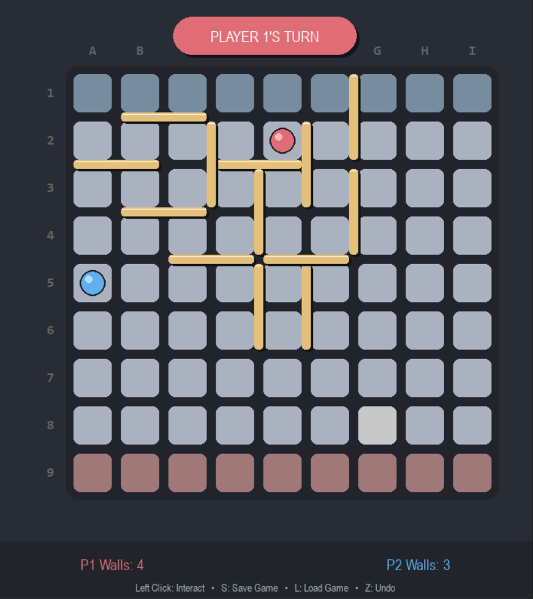

# Quoridor AI - Term Project (CSE472s)
Quoridor-Game AI project for CSE472s course at Ain Shams University faculty of engineering.

A complete Python implementation of the abstract strategy board game **Quoridor**, featuring a Modern GUI, Game State Management, and an Advanced AI Opponent using Minimax with Beam Search.

 


## 📋 Table of Contents
- [Project Overview](#project-overview)
- [Features](#features)
- [Installation & Running](#installation--running)
- [Controls](#controls)
- [AI Implementation](#ai-implementation)
- [Game Rules](#game-rules)

## 🎮 Project Overview
This project is an implementation of Quoridor, a strategy game played on a 9x9 grid. The goal is to be the first player to reach the opposite side of the board. Players can either move their pawn or place a wall to block their opponent.

This implementation satisfies all core requirements and bonus features for the **CSE472s Fall 2025** Term Project.

## ✨ Features
### Core Gameplay
* **Full Ruleset:** Supports standard 2-player Quoridor rules, including path checking (BFS) to prevent completely blocking a player.
* **Modern UI:** A dark-themed, polished interface with 3D-styled pawns, wall shadows, and smooth notifications.
* **Smart Hover:** Wall orientation and placement are automatically determined by mouse position (no rotation key needed).

### Artificial Intelligence
* **Difficulty Levels:** Easy (Random), Medium (Greedy), Hard (Minimax).
* **Advanced Algorithm:** Uses **Minimax with Alpha-Beta Pruning** and **Beam Search** (Depth 3) to look ahead.
* **Smart Heuristics:** The AI calculates the shortest path for both players and actively tries to "cut" the opponent's optimal path.

### Bonus Features
* **Undo/Redo:** Full history stack support. "Smart Undo" in AI mode rewinds 2 turns (Human + AI) instantly.
* **Save/Load:** Serialize game state to file to resume later.
* **Main Menu:** Interactive menu to select modes and difficulty.

## ⚙️ Installation & Running

### Prerequisites
* Python 3.10 or higher
* `pygame` library

### Setup
1.  **Clone the repository:**
    ```bash
    git clone https://github.com/7ekmaz/Quoridor-Game-CSE472s_Artificial-Intelligence.git
    cd Quoridor-AI
    ```

2.  **Install dependencies:**
    ```bash
    pip install pygame
    ```

3.  **Run the game:**
    ```bash
    python gui.py
    ```

## ⌨️ Controls

| Input | Action |
| :--- | :--- |
| **Left Click (Cell)** | Move Pawn |
| **Left Click (Gap)** | Place Wall (Orientation is automatic) |
| **Z** | Undo Move |
| **Y** | Redo Move |
| **S** | Save Game |
| **L** | Load Game |
| **M** | Return to Main Menu |

## 🧠 AI Implementation
The "Hard" AI agent uses a competitive decision-making process designed to challenge human players:

1.  **Search Algorithm:** A **Minimax** algorithm with **Alpha-Beta Pruning** is used to simulate future board states.
2.  **Beam Search:** To improve performance, the AI only investigates the top $N$ most promising moves at each depth, allowing it to search deeper (Depth 3) without freezing the game.
3.  **Evaluation Function:**
    * $Score = (OpponentDistance - MyDistance)$
    * **Path Torture:** The AI specifically identifies walls that increase the opponent's path length.
    * **Center Control:** The AI prefers staying in the center columns (3-5) to maximize mobility.

## 📜 Game Rules
1.  **Objective:** The first player to reach any square on the opposite side of the board wins.
2.  **Movement:** Pawns move one square horizontally or vertically.
3.  **Walls:**
    * Each player starts with 10 walls.
    * Walls are 2 squares long.
    * Walls cannot overlap or cross.
    * **Critical Rule:** You cannot place a wall that completely blocks the only remaining path to the goal for *any* player.
4.  **Jumping:** If pawns are face-to-face, the active player can jump over the opponent.

## 🎥 Demo Video
[Link to YouTube Demo Video] 


---
**Course:** CSE472s - Artificial Intelligence  
**Term:** Fall 2025  
**Team Members:** 
* Kareem Wael Elhamy 2100631
* Azza Hasan Said 2101808
* Akram Emad Eldin
* Aya Tarek
* Mohamed Essam
* Mennatullah Hussain
